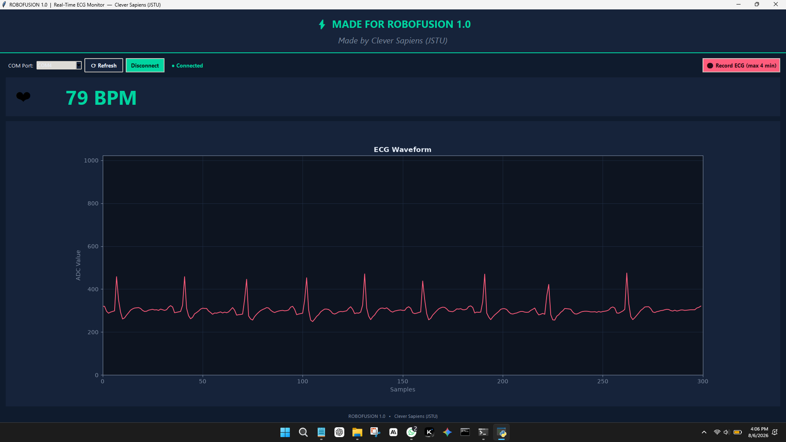

# Real-Time ECG Monitoring System


## Course Code EEE 2122
Jamalpur Science and Technology University
## 👥 Group Members:
- SM Saiful Islam Tutul
- Dhruba Acharjee
- Nahiyan Mokarrim
- Sanot Kumar Ghosh

## Supervisor
Md Mahfuzul Haque, Assistant Professor, EEE, JSTU

## Components
- Arduino Nano
- AD8232 ECG Module
- Electrodes (3 lead)
- ECG gel
- Female To Female Wire

## Circuit Diagram


## ⚙️ How to Run

### 🔌 Hardware Setup
- Connect the Arduino Nano to your Laptop using a USB Cable
- No external power supply needed — runs directly from Laptop
- Attach the AD8232 electrodes on your body (Right Arm, Left Arm, Right Leg)

### 📌 Pin Connection

| AD8232 | Arduino Nano |
|--------|-------------|
| VCC    | 3.3V        |
| GND    | GND         |
| OUTPUT | A0          |
| LO+    | D10         |
| LO-    | D11         |

> ⚠️ VCC must be connected to **3.3V** only. Connecting to 5V will damage the IC.

---

### 💻 Software Setup

1. Download [Arduino IDE](https://www.arduino.cc/en/software)
2. Open `ECG_Machine.ino` in Arduino IDE
3. Go to **Tools → Board → Arduino Nano**
4. Select the correct COM port from **Tools → Port**
5. Click the **Upload** button ✅
> 💡 **Upload failed?** Go to **Tools → Processor → ATmega328P (Old Bootloader)** and try again.
---

### 📈 How to View ECG Wave

After uploading —
1. Go to **Tools** in Arduino IDE
2. Click **Serial Plotter**
3. Set baud rate to **115200**
4. Real-time ECG wave will appear 💓

---

### 💟 How to View BPM

1. Go to **Tools** in Arduino IDE
2. Click **Serial Monitor**
3. Set baud rate to **115200**
4. You will see output like this —

```
ECG:487,BPM:72
ECG:510,BPM:72
ECG:498,BPM:73
```

---

### ⚠️ Lead-Off Detection

If electrode gets disconnected from body —
- ECG signal will immediately drop to **0**
- BPM will also show **0**
- Signal will resume automatically once electrode is reconnected ✅


## Features
- Real-time ECG signal display
- BPM detection
- Lead-off detection
- 
## Useing Custome GUI 

# Real-Time ECG Monitor GUI — User Guide

A Python-based graphical user interface (GUI) built for **ROBOFUSION 1.0** by **Clever Sapiens (JSTU)** to monitor, record, and process real-time ECG signals received from an Arduino or microcontroller via serial communication.

---

## 🛠️ Prerequisites & Installation

Before running the application, make sure Python (3.8 or higher) is installed on your system.

Install the required dependencies using `pip`:

```bash
pip install pyserial matplotlib pyautogui
 ```

### Note: For WhatsApp automated sending features, Windows OS is required as it uses PowerShell clipboard integration and standard keyboard automation shortcuts.

#Step 1: Connect Your Hardware
Connect your Arduino / ECG hardware module to your PC via USB.

Launch the application script:

Bash
python Custom_GUI.py
Select the correct COM Port from the dropdown menu at the top left. If the port is not listed, click ⟳ Refresh.

Click the Connect button. Once successfully connected, the status indicator will switch to green showing ● Connected.

# Step 2: Live Monitoring
ECG Waveform: Displays a real-time, scrolling ECG graph (ADC value vs. sample data).

BPM Display: Calculates and displays your real-time heart rate in Beats Per Minute (BPM).

Lead Off Detection: If electrode leads are disconnected or zero values are detected continuously, a warning message will appear: ⚠ Leads Off Detected — CHECK ELECTRODE.

# Step 3: Record ECG Signal
To record a patient's ECG session, click the 🔴 Record ECG (max 4 min) button.

A Patient Info popup window will appear:

Name & Age: Enter patient details (Required).

Mobile Number (Optional): Enter the phone number with country code (e.g., 88017XXXXXXXX) if you want the generated report sent automatically via WhatsApp.

Click ▶ Start Recording.

The system will continuously record ECG data up to a maximum limit of 4 minutes. You can also stop early by clicking ⏹ Stop & Save.

# Step 4: PDF Report Generation & Automated WhatsApp Transfer
Once recording stops, the application automatically compiles all recorded waveforms and BPM statistics into a professional multipage PDF Report.

PDF files are saved locally inside your user home directory under the ECG_Reports folder.

WhatsApp Integration:

If a mobile number was provided, WhatsApp Web will open automatically in your browser.

The application copies the generated PDF to your Windows clipboard and simulates pasting (Ctrl + V) and sending (Enter) the document to the patient.

# ⚙️ Configuration & Settings
You can adjust key default constants at the top of the Python file if needed:

BAUD_RATE: 115200 (Must match your Arduino code baud rate)

PLOT_SECONDS: 6 (Time window displayed on the live chart)

SAMPLE_INTERVAL_MS: 20 (Sampling delay interval in milliseconds)

RECORD_LIMIT_SECONDS: 240 (Maximum recording duration of 4 minutes)


## Final project View 



## 🎥 Demo Video
[▶ Watch Demo on YouTube]([https://youtu.be/joZa_iyXXQM?si=kgzlvJR6DlNOQI7t](https://youtu.be/pZa48mLodrk)


