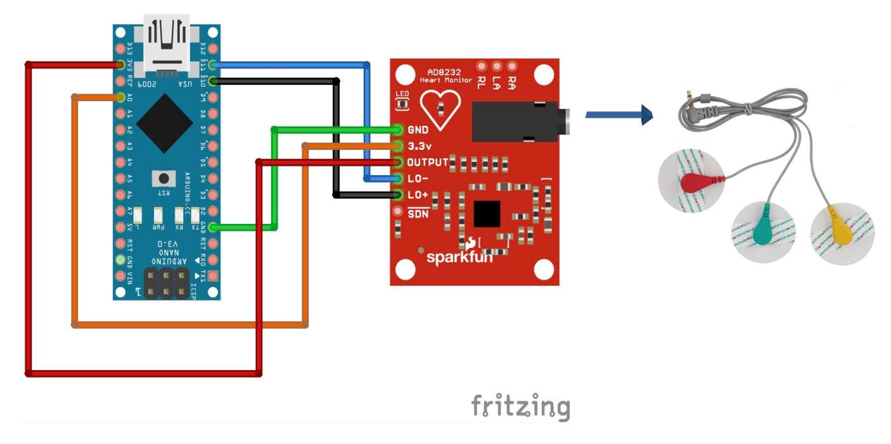
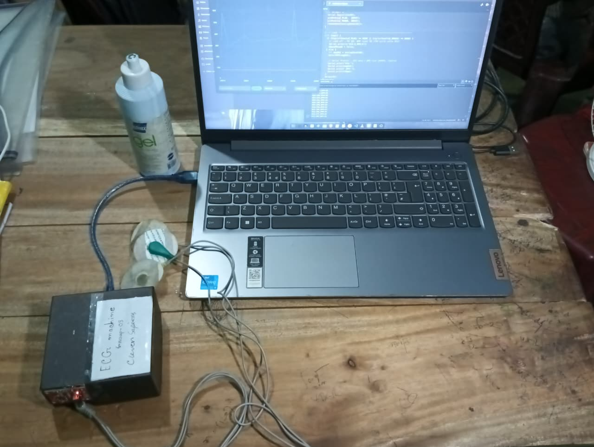
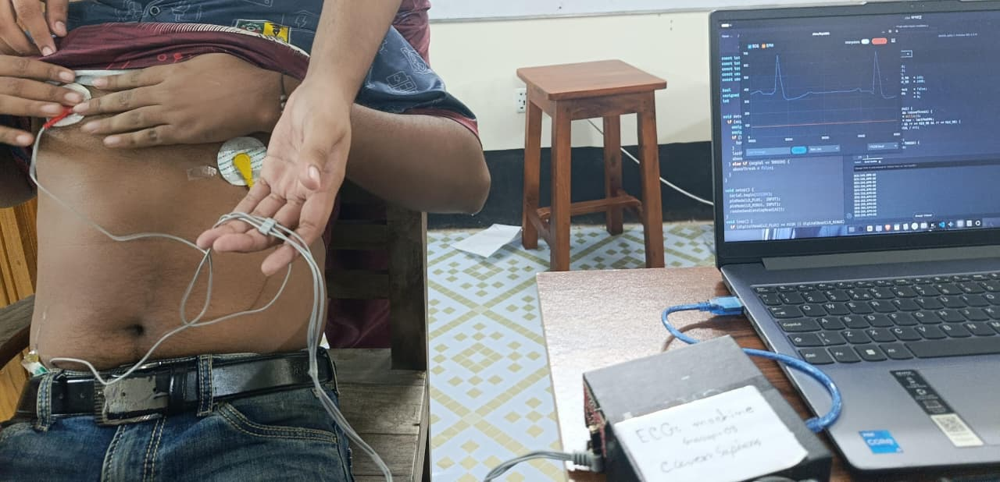

# DIY ECG Machine using Arduino Nano and AD8232

## Course Code EEE 2122
Jamalpur Science and technlogy University

## Components
- Arduino Nano
- AD8232 ECG Module
- Electrodes (3 lead)

## Circuit Diagram



## ⚙️ How to Run

### 🔌 Hardware Setup
- Connect the Arduino Nano to your Laptop using a USB Cable
- No external power supply needed — runs directly from Laptop
- Attach the AD8232 electrodes on your body (Right Arm, Left Arm, Right Leg)

### 📌 Pin Connection

| AD8232 | Arduino Nano |
|--------|-------------|
| VCC    | 3.3V        |
| GND    | GND         |
| OUTPUT | A0          |
| LO+    | D10         |
| LO-    | D11         |

> ⚠️ VCC must be connected to **3.3V** only. Connecting to 5V will damage the IC.

---

### 💻 Software Setup

1. Download [Arduino IDE](https://www.arduino.cc/en/software)
2. Open `ECG_Machine.ino` in Arduino IDE
3. Go to **Tools → Board → Arduino Nano**
4. Select the correct COM port from **Tools → Port**
5. Click the **Upload** button ✅
> 💡 **Upload failed?** Go to **Tools → Processor → ATmega328P (Old Bootloader)** and try again.
---

### 📈 How to View ECG Wave

After uploading —
1. Go to **Tools** in Arduino IDE
2. Click **Serial Plotter**
3. Set baud rate to **115200**
4. Real-time ECG wave will appear 💓

---

### 💟 How to View BPM

1. Go to **Tools** in Arduino IDE
2. Click **Serial Monitor**
3. Set baud rate to **115200**
4. You will see output like this —

```
ECG:487,BPM:72
ECG:510,BPM:72
ECG:498,BPM:73
```

---

### ⚠️ Lead-Off Detection

If electrode gets disconnected from body —
- ECG signal will immediately drop to **0**
- BPM will also show **0**
- Signal will resume automatically once electrode is reconnected ✅


## Features
- Real-time ECG signal display
- BPM detection
- Lead-off detection

## Final project View 




## Project presentation video


## Supervisor
Md Mahfuzul Haque, Assistant Professor, EEE, JSTU
